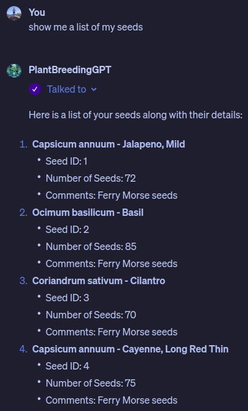

# 🌿 PlantBreedingGPT 🌿

PlantBreedingGPT is your digital gardening companion that roots a MySQL database (code-first with alembic) and API on the cloud, 
allowing a custom GPT in ChatGPT to tend to your data garden through REST API calls, managing your plant breeding experiments with speech and photos. 
Designed for AWS RDS and Lambda with FastAPI, this template is a fun, experimental project tailored to my personal grow operation.

## 📷 Screenshots

  

## 🛠 Usage Instructions

### 🌱 Prerequisites

Make sure you're equipped with:

* AWS account
* AWS CLI
* SAM CLI
* Python 3.11

### 🚀 Planting the Seeds (Deploying)

1. **Clone the repository:** Pick the choicest code cuttings for your garden.
1. **Deploy your garden:**
    ```markdown
    sam sync --parameter-overrides DbPassword="your-db-password" ApiKey="your-api-key" --stack-name plants-stack
    ```
    Don't forget to replace `your-db-password` and `your-api-key` with your actual secrets.
2. With the URL that SAM CLI outputs, you can now make API calls to your garden!
3. In ChatGPT, you can now create a custom GPT that calls your garden's API. Import the OpenAPI spec from `<your url>/openapi.json`.
4. Use provided instructions (chatgpt-instructions.md) to set up your custom GPT in ChatGPT.
4. 🌱 **Plant your seeds!** 🌱

### 📚 Database Overview

Here's the structure of your PlantBreedingGPT's knowledge base (more details in api/models.py):

- 🌱 `germination`: Records seed germination details, including dates and methods.
- 💧 `hydroponic_system`: Describes different hydroponic systems and their characteristics.
- 📊 `hydroponic_conditions`: Tracks water conditions in hydroponic systems over time.
- 🌺 `plant_crosses`: Details the process and results of plant crossbreeding efforts.
- 🌿 `plants`: Catalogs plants, linking them to their germination and hydroponic system details.
- 📈 `observations`: Logs regular observations of plant growth and health indicators.
- 🤝 `plant_plant_cross`: Connects plants to their crossbreeding events and roles.
- 🍽️ `taste_test`: Assesses the taste, texture, and appearance of plants.
- 📦 `yield`: Records harvested plant yields, their characteristics, and related crossbreeding info.
- 🌾 `seeds`: Keeps inventory of seeds, including counts and varieties.
